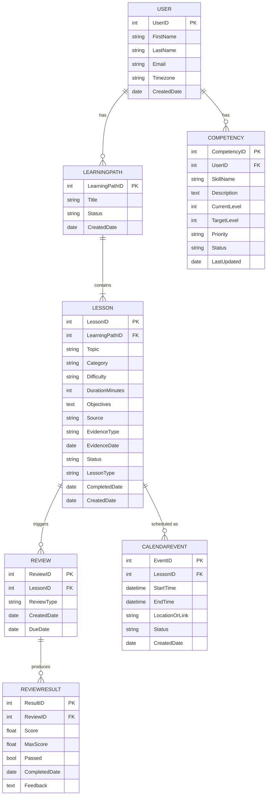
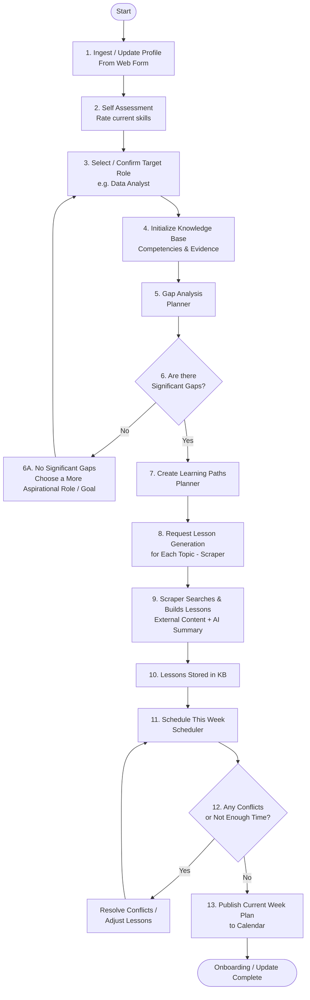
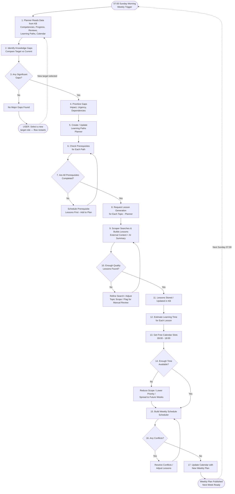
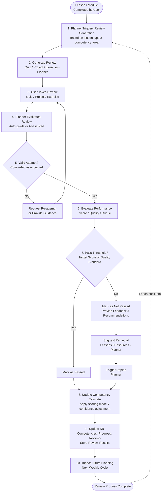

# Learning Scheduler — High Level Design

## System Overview

### System Description

The Learning Scheduler is an intelligent learning-planning system designed to help users close professional competency gaps through personalized, adaptive learning plans.

The system maintains a knowledge profile of the user, including their current competencies, learning history, completed lessons, projects, certifications, career goals, and identified skill gaps. Based on this information, the system continuously generates and updates learning paths that are aligned with the user's target role and professional objectives.

The system operates through a weekly planning cycle that analyzes the user's current state, identifies competency gaps, prioritizes learning topics, generates lessons, and schedules learning activities into available calendar slots. The planning cycle runs automatically every Sunday at 07:00 and creates a learning schedule for the upcoming week.

Users may also update the system manually by submitting new information such as completed courses, projects, certifications, competency updates, or changes to career goals. Significant updates trigger a re-evaluation of competencies, learning paths, and scheduling decisions.

The system uses a feedback-driven learning model. After completing lessons, users perform reviews that may include quizzes, projects, exercises, or assessments. Review results are used to update competency estimates and recalculate future learning priorities. This feedback loop enables the system to continuously adapt learning plans based on demonstrated progress.

The system is composed of four primary components:

- **Knowledge Base (KB)** — stores competencies, learning history, lessons, reviews, learning paths, evidence, and career objectives.
- **Planner** — analyzes competency gaps, prioritizes learning objectives, creates learning paths, and generates reviews.
- **Scraper** — gathers external learning resources and assembles lessons using publicly available content and AI-generated summaries.
- **Scheduler** — allocates learning activities into available calendar slots and maintains the weekly learning schedule.

The Knowledge Base serves as the system of record, while the review process serves as the primary feedback mechanism that continuously improves competency estimates and drives future planning decisions.

The overall objective of the system is to provide a personalized, adaptive, and continuously evolving learning experience that helps users efficiently progress toward their target professional roles.

---

## Primary Processes

## Components

### Scraper

**High-Level Description:** The component is responsible for obtaining web data in order to support the requirements of the different components. The component receives requests to look up specific, defined types of web data, performs searches to obtain that data, and returns it to the requester.

**Main Process Flows:**
- Obtaining public job listings — the component receives requests to obtain public job listings for a specified role/title and searches for job descriptions matching that role/title and returns the contents and metadata of all applicable job postings.
- Looking up lesson material / available training related to a specific subject — the component receives requests to obtain material used to learn about a specific subject and returns it.
- Assemble lessons based on requested topics.
- Build lesson content using external learning resources and AI-generated summaries.
- Generate lesson metadata, exercises and review material.
- Return completed lessons to the planner.

**Component Dependencies:** None — component is independent, searching publicly accessible internet pages.

**Data Dependencies:** Job Listings, Lessons.

### Knowledge Base (KB)

**High-Level Description:** The component is responsible for holding data about what the user knows, their competency, and what their gaps are. Additionally, the KB holds the contents of lessons, both the ones already completed by the user and ones that aren't. The component receives requests to update the list of topics according to user updates or updates from the scraper.

The KB will be based on a SQLite database. KB will store lesson metadata in the DB and lesson contents in files.

**Main Process Flows:**
- Holds data related to the knowledge of the user, their competency, and what their gaps are. The component receives requests to update the list of topics according to user updates or updates from the scraper.
- Holds contents of lessons and their associated metadata. The component receives requests to add lessons from the scraper.
- Receives requests to update completion of user lessons from the planner, and update user competency of topics.
- Store competency evidence.
- Store learning paths.
- Store review results.
- Receive onboarding information from CV, LinkedIn, projects, self-assessment and job target.

**Component Dependencies:** None — component is independent.

**Data Dependencies:** Lessons, Topic Competency, Learning Paths, Competency Evidence, Review Results.

### Planner

**High-Level Description:** The component is responsible for getting data about the user competency gaps from the KB. According to the data that the component receives from the KB, the planner needs to send requests to the scraper to create lessons based on the topics that the user needs to work on.

**Main Process Flows:**
- Getting data about the user competency gaps from the KB.
- The planner sends requests to the scraper to create lessons.
- After completion of lessons, the planner updates the KB on lessons status and topic competency.
- Determine required learning paths based on competency gaps.
- Request lesson generation for the required topics from the scraper.
- Trigger review generation after lesson completion.
- Update competency according to quiz and project review results.
- Store generated lessons in the KB.
- Generate reviews.

**Component Dependencies:** Knowledge Base, Scraper.

**Data Dependencies:** Topic Competency, Lessons.

### Scheduler

**High-Level Description:** The component is responsible for getting data about the lessons needed to be scheduled — their topics, their length, etc. According to the data the component receives from the planner, the scheduler needs to update the user's calendar.

The scheduler will only support Google Calendar for scheduling.

**Main Process Flows:**
- Getting data about the lessons needed to be scheduled.
- The scheduler needs to update the user calendar.
- The scheduler operates as part of a weekly planning cycle.
- The schedule is recreated from scratch once per week.
- The scheduler identifies free calendar slots between 09:00 and 18:00.
- Manual KB updates can trigger schedule regeneration.
- Only the next week is planned.
- If there is insufficient time, prioritize highest-priority lessons.

**Component Dependencies:** Planner.

**Data Dependencies:** Lessons.

---

## Data Model (ERD)

**LessonType values:**
- `CompletedExperience` — already completed by the user (e.g., job experience, course, project, certification)
- `PlannedLesson` — generated by the Planner to fill a competency gap
- `ManualLesson` — added manually by the user

**Notes:**
- There is a single User in the system.
- All knowledge (past experience or future learning) is stored as a Lesson.
- Evidence is represented as Lessons with `LessonType = CompletedExperience`.
- Competency is simplified to a single entity with 1–5 level ranking.
- Lesson Status examples: Planned, In Progress, Completed, Archived.
- CurrentLevel and TargetLevel range: 1–5.

---

## Flow 1: Onboarding & Update Flow

**Goal:** Continuously assess gaps, schedule learning, and adapt as the user grows. Allow user to manually update information and keep the system accurate and up to date.

**Inputs (Web Form):**
- Personal & Background (CV): name, role, location, summary
- Skills & Experience: skills, tools, years of experience, achievements
- Past Projects: project name, description, role, impact, tech used
- Target Role / Goal: desired role, level, key responsibilities, must-have skills
- Courses / Certifications: name, provider, date, status, score
- Preferences: learning style, time availability, weekly hours, topics of interest

**Notes:**
- The system assumes lessons are completed successfully when planning the week.
- Replanning is triggered by significant changes only.
- All updates (profile or progress) flow through the same process.
- The Knowledge Base (KB) is the single source of truth.

---

## Flow 2: Weekly Planning Flow

**Goal:** Review current state, find gaps, plan learning, generate lessons, and schedule the next week.

**Trigger:** Every Sunday at 07:00.

**About loop directions:**
- **Rightward "No" arrows** (steps 7 and 10): Perform an action to fix the issue, then continue forward to re-check.
- **Leftward "No" arrows** (steps 14 and 16): Adjust the plan (reduce scope or resolve conflicts), then return to rebuild the schedule.

**When does the flow restart (mid-week)?**
- If target role changes Monday–Saturday: flow restarts the **day after**.
- If target role changes on Sunday: flow restarts the **same day** so no learning days are missed.

---

## Flow 3: Lesson Completion & Review Flow

**Goal:** Evaluate learning, update competency, and adapt future learning paths.

**Feedback loop:** Learn → Review → Update Competency → Adjust Future Learning

**Notes:**
- Reviews can be quizzes, projects, coding exercises, case studies, etc.
- Competency changes drive future learning decisions.
- This is the core feedback loop of the system.
